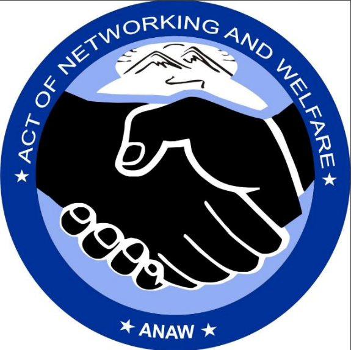

# ANAW - Act of Networking and Welfare



> **Moringa AI Capstone Project: Building a Beginner's Toolkit for PHP & MySQL Web Development**  
> *Duration: Monday 29th September – Thursday 2nd October (11:59pm)*

## 🌟 Overview

ANAW (Act of Networking and Welfare) is a comprehensive web platform designed to connect members worldwide to support communities in Sudan through networking, welfare programs, and collaborative efforts. This project serves as a beginner's toolkit for learning PHP and MySQL web development through a real-world application.

## 🎯 Project Goals

This capstone project demonstrates:
- **PHP Backend Development**: Server-side logic, session management, and database interactions
- **MySQL Database Design**: Relational database structure with proper foreign key relationships
- **Full-Stack Integration**: Seamless connection between frontend and backend
- **User Authentication**: Role-based access control system
- **CRUD Operations**: Complete Create, Read, Update, Delete functionality

## ✨ Features

### 🌐 Public Website
- **Responsive Design**: Mobile-friendly interface with modern UI
- **Tab-based Navigation**: Home, About, Programs, Meetings, Donate, Contact
- **Interactive Elements**: Smooth animations and transitions
- **Contact Form**: Integrated with FormSubmit for email handling
- **Social Media Integration**: Links to various platforms

### 👨‍💼 Admin Dashboard
- **Member Management**: Add, view, and delete members
- **Meeting Scheduling**: Create and manage virtual meetings
- **Project Management**: Track active projects and budgets
- **Announcement System**: Post updates to different user groups
- **Statistics Overview**: Dashboard with key metrics

### 👥 Member Dashboard
- **Personal Donation Tracking**: View donation history and totals
- **Meeting Access**: Join scheduled virtual meetings
- **Announcement Feed**: Stay updated with organization news
- **Project Information**: View active initiatives
- **Donation Portal**: Make contributions to specific projects

## 🛠️ Technology Stack

| Component | Technology | Purpose |
|-----------|------------|---------|
| **Frontend** | HTML5, CSS3, JavaScript | User interface and interactions |
| **Backend** | PHP 7.4+ | Server-side logic and API |
| **Database** | MySQL 5.7+ | Data storage and management |
| **Styling** | Custom CSS with CSS Variables | Modern, responsive design |
| **Icons** | Font Awesome 6.4.0 | UI iconography |
| **Forms** | FormSubmit.co | Contact form handling |

## 📁 Project Structure

```
anaw-website/
├── index.php              # Main landing page
├── login.php             # User authentication
├── logout.php            # Session termination
├── admin.php             # Admin dashboard
├── dashboard.php         # Member dashboard
├── config.php            # Database configuration
├── includes/             # Reusable PHP components
│   ├── header.php
│   ├── footer.php
│   └── functions.php
├── css/                  # Stylesheets
│   ├── main.css
│   └── dashboard.css
├── js/                   # JavaScript files
│   ├── main.js
│   └── dashboard.js
├── images/               # Image assets
│   └── logo.png
├── sql/                  # Database scripts
│   └── anaw_db.sql
└── README.md            # This file
```

## 🚀 Installation & Setup

### Prerequisites

Before you begin, ensure you have the following installed:

- **Web Server**: Apache or Nginx
- **PHP**: Version 7.4 or higher
- **MySQL**: Version 5.7 or higher
- **Modern Web Browser**: Chrome, Firefox, Safari, or Edge

### Step-by-Step Installation

#### 1. Clone the Repository

```bash
git clone https://github.com/yourusername/anaw-website.git
cd anaw-website
```

#### 2. Database Setup

Create a MySQL database and import the schema:

```sql
-- Create database
CREATE DATABASE anaw_db CHARACTER SET utf8mb4 COLLATE utf8mb4_unicode_ci;

-- Use the database
USE anaw_db;

-- Import the provided SQL schema (see Database Schema section below)
```

#### 3. Configure Database Connection

Update `config.php` with your database credentials:

```php
<?php
define('DB_HOST', 'localhost');
define('DB_NAME', 'anaw_db');
define('DB_USER', 'your_username');
define('DB_PASS', 'your_password');
define('DB_CHARSET', 'utf8mb4');

// Database connection
try {
    $pdo = new PDO("mysql:host=" . DB_HOST . ";dbname=" . DB_NAME . ";charset=" . DB_CHARSET, DB_USER, DB_PASS);
    $pdo->setAttribute(PDO::ATTR_ERRMODE, PDO::ERRMODE_EXCEPTION);
} catch(PDOException $e) {
    die("Connection failed: " . $e->getMessage());
}
?>
```

#### 4. Web Server Configuration

**For Apache:**
Ensure your `.htaccess` file includes:
```apache
RewriteEngine On
DirectoryIndex index.php
```

**For Nginx:**
Add this to your server block:
```nginx
index index.php index.html;
location ~ \.php$ {
    fastcgi_pass unix:/var/run/php/php7.4-fpm.sock;
    fastcgi_index index.php;
    include fastcgi_params;
}
```

#### 5. File Permissions

Set appropriate permissions:
```bash
chmod 644 *.php
chmod 755 images/
chmod 644 css/* js/*
```

## 🗄️ Database Schema

The application uses a relational database with the following tables:

### Users Table
```sql
CREATE TABLE users (
    id INT AUTO_INCREMENT PRIMARY KEY,
    name VARCHAR(100) NOT NULL,
    email VARCHAR(100) UNIQUE NOT NULL,
    password VARCHAR(255) NOT NULL,
    phone VARCHAR(20),
    country VARCHAR(50),
    role ENUM('admin', 'member') DEFAULT 'member',
    status ENUM('active', 'inactive') DEFAULT 'active',
    created_at TIMESTAMP DEFAULT CURRENT_TIMESTAMP
);
```

### Meetings Table
```sql
CREATE TABLE meetings (
    id INT AUTO_INCREMENT PRIMARY KEY,
    title VARCHAR(200) NOT NULL,
    description TEXT,
    meeting_link VARCHAR(500),
    meeting_date DATETIME,
    duration INT,
    status ENUM('scheduled', 'completed', 'cancelled') DEFAULT 'scheduled',
    created_by INT,
    created_at TIMESTAMP DEFAULT CURRENT_TIMESTAMP,
    FOREIGN KEY (created_by) REFERENCES users(id)
);
```

### Projects Table
```sql
CREATE TABLE projects (
    id INT AUTO_INCREMENT PRIMARY KEY,
    title VARCHAR(200) NOT NULL,
    description TEXT,
    location VARCHAR(100),
    budget DECIMAL(10,2),
    status ENUM('planning', 'active', 'completed', 'on_hold'),
    start_date DATE,
    end_date DATE,
    created_by INT,
    created_at TIMESTAMP DEFAULT CURRENT_TIMESTAMP,
    FOREIGN KEY (created_by) REFERENCES users(id)
);
```

### Announcements Table
```sql
CREATE TABLE announcements (
    id INT AUTO_INCREMENT PRIMARY KEY,
    title VARCHAR(200) NOT NULL,
    content TEXT NOT NULL,
    type ENUM('general', 'project', 'meeting', 'financial'),
    priority ENUM('low', 'medium', 'high'),
    target_audience ENUM('all', 'members', 'admins'),
    created_by INT,
    created_at TIMESTAMP DEFAULT CURRENT_TIMESTAMP,
    FOREIGN KEY (created_by) REFERENCES users(id)
);
```

### Donations Table
```sql
CREATE TABLE donations (
    id INT AUTO_INCREMENT PRIMARY KEY,
    member_id INT,
    amount DECIMAL(10,2) NOT NULL,
    currency VARCHAR(3) DEFAULT 'USD',
    donation_type ENUM('one-time', 'monthly', 'quarterly', 'annual'),
    project_id INT NULL,
    status ENUM('pending', 'confirmed', 'cancelled') DEFAULT 'pending',
    donation_date DATE,
    created_at TIMESTAMP DEFAULT CURRENT_TIMESTAMP,
    FOREIGN KEY (member_id) REFERENCES users(id),
    FOREIGN KEY (project_id) REFERENCES projects(id)
);
```

## 🎮 Usage Guide

### For Regular Users
1. **Registration**: Visit the homepage and click "Sign Up"
2. **Login**: Use your credentials to access the member dashboard
3. **Donations**: Navigate to the donation portal to contribute
4. **Meetings**: Join scheduled meetings from your dashboard
5. **Updates**: Check announcements for latest news

### For Administrators
1. **Login**: Use admin credentials to access admin dashboard
2. **Member Management**: Add, edit, or remove members
3. **Schedule Meetings**: Create and manage virtual meetings
4. **Project Management**: Track and update project progress
5. **Announcements**: Post updates to specific user groups

## 🤖 AI Prompts Used in Development

This project was developed using AI assistance. Here are the key prompts used:

### Initial Setup Prompts
```
"Create a PHP login system with session management and MySQL database integration"
"Design a responsive dashboard layout for member and admin interfaces"
"Generate SQL schema for a membership management system with donations and meetings"
```

### Feature Development Prompts
```
"Implement role-based access control in PHP with admin and member roles"
"Create a meeting scheduling system with CRUD operations"
"Build a donation tracking system with different payment types"
```

### Styling and UI Prompts
```
"Create modern CSS styles with CSS variables for theme consistency"
"Design responsive navigation with mobile hamburger menu"
"Implement smooth animations and transitions for better UX"
```

## 🐛 Common Issues & Solutions

### Database Connection Issues
**Problem**: "Connection failed" error  
**Solution**: 
- Check database credentials in `config.php`
- Ensure MySQL service is running
- Verify database exists and has proper permissions

### Session Management Issues
**Problem**: Users getting logged out unexpectedly  
**Solution**:
- Check `session_start()` is called on all protected pages
- Verify session timeout settings
- Ensure cookies are enabled in browser

### File Upload Issues
**Problem**: Images not uploading properly  
**Solution**:
- Check file permissions on upload directory
- Verify `upload_max_filesize` in PHP configuration
- Ensure proper file type validation

### CSS/JS Not Loading
**Problem**: Styles or scripts not applying  
**Solution**:
- Check file paths are correct
- Verify web server configuration
- Clear browser cache

## 📚 Learning Outcomes

Through this project, you will learn:

- **PHP Fundamentals**: Variables, functions, classes, and OOP concepts
- **MySQL Database Design**: Table relationships, constraints, and indexing
- **Session Management**: User authentication and authorization
- **Security Best Practices**: Password hashing, SQL injection prevention
- **Frontend Integration**: Connecting PHP backend with HTML/CSS/JS frontend
- **CRUD Operations**: Complete data manipulation workflows
- **Error Handling**: Debugging and exception management

## 🔧 API Endpoints

The application includes several API endpoints for data management:

| Endpoint | Method | Purpose |
|----------|--------|---------|
| `/api/login.php` | POST | User authentication |
| `/api/members.php` | GET/POST/PUT/DELETE | Member management |
| `/api/meetings.php` | GET/POST/PUT/DELETE | Meeting operations |
| `/api/projects.php` | GET/POST/PUT/DELETE | Project management |
| `/api/donations.php` | GET/POST | Donation tracking |
| `/api/announcements.php` | GET/POST/PUT/DELETE | Announcement system |

## 🧪 Testing

### Manual Testing Checklist
- [ ] User registration and login
- [ ] Admin dashboard functionality
- [ ] Member dashboard features
- [ ] Database CRUD operations
- [ ] Responsive design on mobile
- [ ] Cross-browser compatibility

### Test Data
Use the following test accounts:

**Admin Account:**
- Email: admin@anaw.org
- Password: admin123

**Member Account:**
- Email: member@anaw.org
- Password: member123

## 🤝 Contributing

This is a learning project, but contributions are welcome:

1. Fork the repository
2. Create a feature branch (`git checkout -b feature/new-feature`)
3. Commit your changes (`git commit -am 'Add new feature'`)
4. Push to the branch (`git push origin feature/new-feature`)
5. Create a Pull Request

## 📖 Resources & References

### Official Documentation
- [PHP Manual](https://www.php.net/manual/)
- [MySQL Documentation](https://dev.mysql.com/doc/)
- [MDN Web Docs](https://developer.mozilla.org/)

### Tutorials Used
- [PHP MySQL CRUD Tutorial](https://www.w3schools.com/php/php_mysql_intro.asp)
- [User Authentication in PHP](https://www.tutorialrepublic.com/php-tutorial/php-mysql-login-system.php)
- [Responsive Web Design](https://www.w3schools.com/css/css_rwd_intro.asp)

### Tools & Libraries
- [Font Awesome Icons](https://fontawesome.com/)
- [FormSubmit.co](https://formsubmit.co/) - Contact form handling
- [PHP Password Hashing](https://www.php.net/manual/en/function.password-hash.php)

## 📝 License

This project is open source and available under the [MIT License](LICENSE).

## 👨‍💻 Author

**[Your Name]**  
Moringa School Student  
Capstone Project: PHP & MySQL Web Development  

**Contact:**
- Email: your.email@example.com
- GitHub: [@yourusername](https://github.com/yourusername)
- LinkedIn: [Your LinkedIn](https://linkedin.com/in/yourprofile)

## 🙏 Acknowledgments

- **Moringa School** for providing the learning framework
- **AI.moringaschool.com** for AI assistance during development
- **Open Source Community** for the tools and libraries used
- **ANAW Organization** for the project inspiration

---

*This README was generated as part of the Moringa AI Capstone Project demonstrating the use of AI tools in software development learning.*


